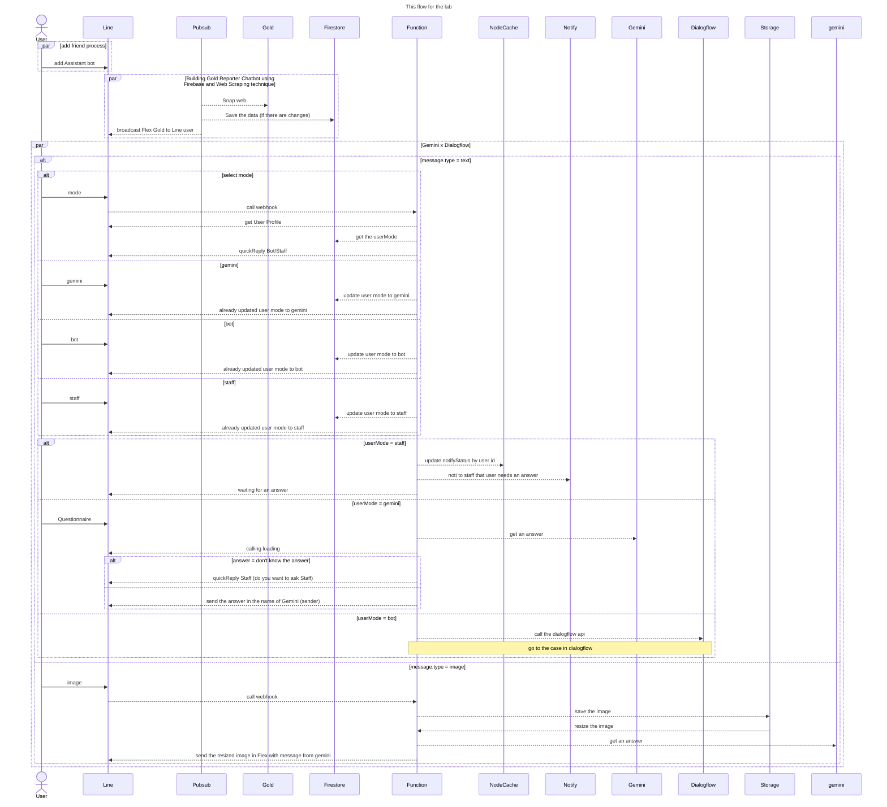
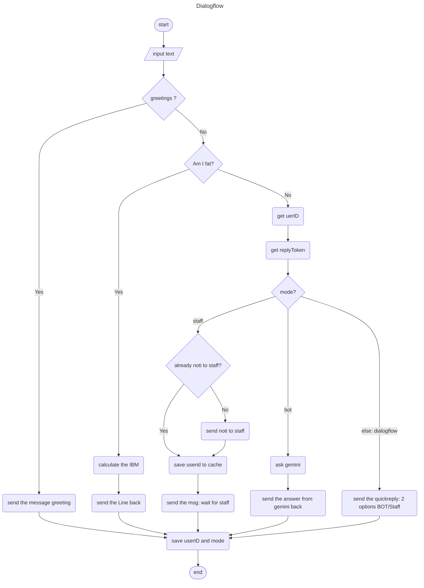
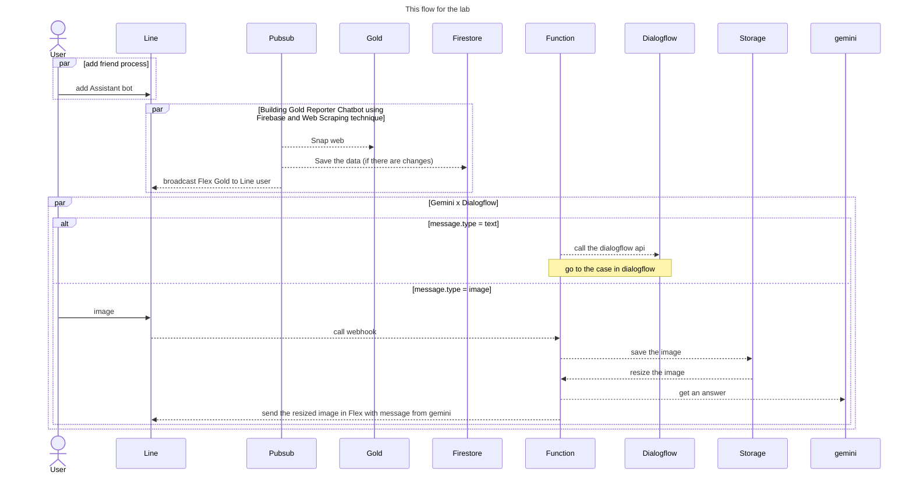
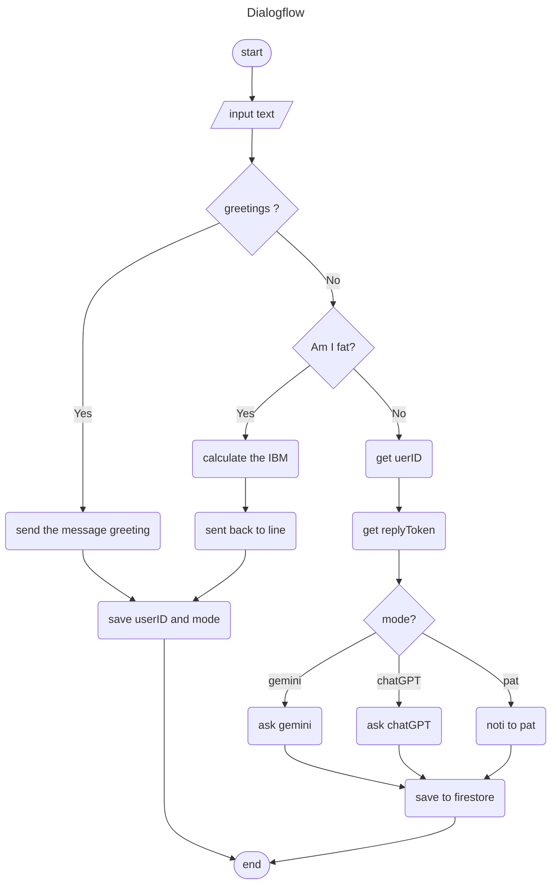

# My Line bot assistance

## Thing 1: Do the Lab from Codelab

<https://codelab.line.me>

- [x] Building GenAI Chatbot using Gemini and Firebase
- [x] Building Gold Reporter Chatbot using Firebase and Web Scraping technique
- [x] Building Image Resizer Chatbot using Firebase
- [x] Building LINE Chatbot using Dialogflow
  - [x] <https://wutthipong.medium.com/ทำ-line-chatbot-เชื่อมกับ-dialogflow-และ-gemini-โดยเลือกถามคนหรือถามบอทได้-ตอนที่-1-line-เชื่อมกับ-02b9840f0f6d>
  - [x] <https://wutthipong.medium.com/ทำ-line-chatbot-เชื่อมกับ-dialogflow-และ-gemini-โดยเลือกถามคนหรือถามบอทได้-ตอนที่-2-line-เชื่อมกับ-4e16570bf745>
- [ ] ChatGPT bot in LINE Group to answer all of your questions!
  - <https://medium.com/linedevth/line-chatgpt-group-9b2fc5ea94d3>
- [ ] Building Shorten URL Chatbot using Dialogflow and Bitly API
- [ ] Handle Non-Text Event with Dialogflow
- [ ] Building Package Tracking Chatbot with ThailandPost API
- [ ] Let's build a cool Jukebox Chatbot in LINE via Spotify API
- [ ] Create LINE Chatbot to extract audio files in Thai with Google Speech-to-Text API
- [ ] Create a Remove background Chatbot and travel the world in 1 second!
- [ ] Create Digital Business Cards without Writing Code using Flex Simulator
- [ ] Easily create a Translation Chatbot with Firebase Extensions
- [ ] Building LIFF app without caching
- [ ] Extend Functionality to your LIFF app by LIFF Plugin

### Flow Chart

### Flow Chart (revised)

## Thing 2: Test Our Idea
